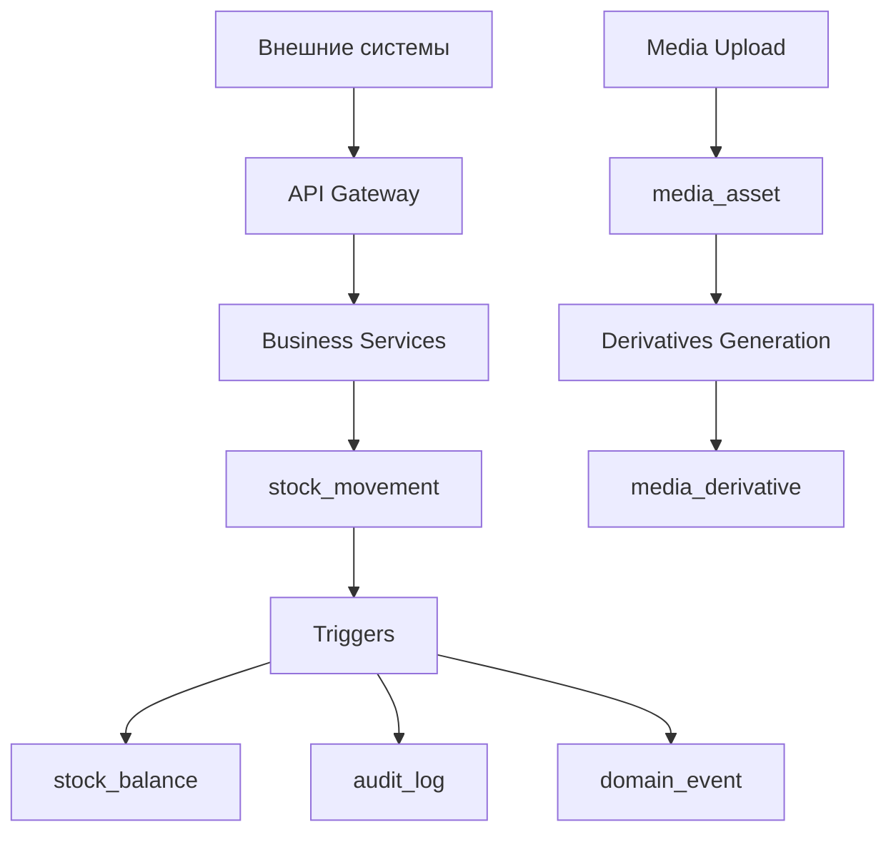

# Документ проектирования

## Обзор

Данный документ описывает проектирование унифицированной схемы базы данных для системы управления складом, которая объединяет функциональность сервисов baselinker_to_wix и allegro_orders_backup. Система построена на принципах event sourcing для движений запасов, с единым источником истины в таблице stock_movement и производными балансами в stock_balance.

### Ключевые принципы проектирования

1. **Единственный источник истины** - все изменения остатков проходят через stock_movement
2. **Неизменяемость движений** - записи в stock_movement никогда не изменяются, только добавляются новые
3. **Полный аудит** - каждая операция записывается в audit_log с состояниями до/после
4. **Упрощенные процессы** - минимум промежуточных этапов (приемка сразу в storage, отгрузка сразу из storage)
5. **Медиа как первоклассные граждане** - изображения и документы с полной трассируемостью

## Архитектура

### Архитектурные слои

```
┌─────────────────────────────────────────────────────────────┐
│                    API Layer                                │
│  (REST endpoints, GraphQL, WebSocket для real-time)        │
└─────────────────────────────────────────────────────────────┘
┌─────────────────────────────────────────────────────────────┐
│                 Business Logic Layer                        │
│     (Services, Domain Events, Business Rules)              │
└─────────────────────────────────────────────────────────────┘
┌─────────────────────────────────────────────────────────────┐
│                  Data Access Layer                          │
│        (Repositories, ORM, Database Triggers)              │
└─────────────────────────────────────────────────────────────┘
┌─────────────────────────────────────────────────────────────┐
│                   Storage Layer                             │
│  PostgreSQL + S3/MinIO (media) + Redis (cache/sessions)    │
└─────────────────────────────────────────────────────────────┘
```

### Поток данных



## Компоненты и интерфейсы

### Основные компоненты системы

#### 1. Inventory Management Core
- **stock_movement** - журнал всех движений (источник истины)
- **stock_balance** - текущие остатки (материализованное представление)
- **inventory_reservation** - резервы под заказы

#### 2. Warehouse Topology
- **warehouse** - склады
- **zone** - зоны склада (receiving, storage, shipping, returns, scrap)
- **bin_location** - конкретные ячейки хранения

#### 3. Product Catalog
- **item** - товары с SKU и характеристиками
- **item_group** - группы товаров с политиками обработки
- **lot** - партии товаров
- **serial_number** - серийные номера

#### 4. Order Management
- **sales_order** - заказы на продажу (из маркетплейсов)
- **return_order** - заказы на возврат

#### 5. Media & Documents
- **media_asset** - оригинальные файлы (неизменяемые)
- **media_derivative** - производные (превью, миниатюры)
- **item_image** - изображения товаров
- **document_file** - документы операций
- **movement_attachment** - файлы к конкретным движениям

#### 6. Analytics & Reporting
- **sales_analytics** - детальная аналитика продаж
- **inventory_analytics** - аналитика оборачиваемости
- **purchase_recommendations** - рекомендации по закупкам

#### 7. Audit & Security
- **audit_log** - полный аудит изменений
- **domain_event** - бизнес-события
- **app_user** - пользователи системы
- **warehouse_access_grant** - права доступа

### Интерфейсы между компонентами

#### Movement Processing Interface
```sql
-- Создание движения с автоматическим обновлением балансов
FUNCTION create_stock_movement(
    warehouse_id UUID,
    source_bin_location_id UUID,
    destination_bin_location_id UUID,
    item_id UUID,
    moved_quantity NUMERIC,
    movement_reason TEXT,
    actor_user_id UUID,
    trigger_source TEXT,
    correlation_identifier UUID
) RETURNS UUID;
```

#### Media Management Interface
```sql
-- Загрузка медиафайла с автоматической генерацией производных
FUNCTION upload_media_asset(
    original_filename TEXT,
    content_sha256 TEXT,
    mime_type TEXT,
    byte_size BIGINT,
    storage_backend TEXT,
    uploaded_by_user_id UUID
) RETURNS UUID;
```

#### Analytics Interface
```sql
-- Создание записи аналитики продаж
FUNCTION record_sale_analytics(
    sales_order_id UUID,
    item_id UUID,
    quantity_sold NUMERIC,
    sale_price NUMERIC,
    cost_price NUMERIC,
    marketplace_channel TEXT,
    sale_date TIMESTAMPTZ
) RETURNS UUID;
```

## Модели данных

### Основные таблицы

#### Склады и топология
```sql
-- Склады
CREATE TABLE warehouse (
    warehouse_id UUID PRIMARY KEY DEFAULT gen_random_uuid(),
    warehouse_code TEXT UNIQUE NOT NULL,
    warehouse_name TEXT NOT NULL,
    warehouse_address TEXT,
    time_zone TEXT NOT NULL DEFAULT 'Europe/Moscow',
    is_active BOOLEAN NOT NULL DEFAULT TRUE,
    created_at TIMESTAMPTZ NOT NULL DEFAULT now(),
    updated_at TIMESTAMPTZ NOT NULL DEFAULT now()
);

-- Зоны склада
CREATE TABLE zone (
    zone_id UUID PRIMARY KEY DEFAULT gen_random_uuid(),
    warehouse_id UUID NOT NULL REFERENCES warehouse(warehouse_id),
    zone_name TEXT NOT NULL,
    zone_function TEXT NOT NULL CHECK (zone_function IN ('receiving', 'storage', 'picking', 'shipping', 'returns', 'scrap')),
    processing_priority INTEGER NOT NULL DEFAULT 100
);

-- Ячейки хранения
CREATE TABLE bin_location (
    bin_location_id UUID PRIMARY KEY DEFAULT gen_random_uuid(),
    warehouse_id UUID NOT NULL REFERENCES warehouse(warehouse_id),
    zone_id UUID NOT NULL REFERENCES zone(zone_id),
    bin_location_code TEXT NOT NULL,
    bin_location_type TEXT NOT NULL CHECK (bin_location_type IN ('pallet', 'shelf', 'flow_rack', 'staging')),
    maximum_weight_kilograms NUMERIC(12,3),
    maximum_volume_cubic_meters NUMERIC(12,4),
    is_pick_face BOOLEAN NOT NULL DEFAULT FALSE,
    UNIQUE(warehouse_id, bin_location_code)
);
```

#### Товары и группы
```sql
-- Группы товаров
CREATE TABLE item_group (
    item_group_id UUID PRIMARY KEY DEFAULT gen_random_uuid(),
    item_group_code TEXT UNIQUE NOT NULL,
    item_group_name TEXT NOT NULL,
    handling_policy JSONB -- {"prohibit_mixing_lots": true, "require_serial_tracking": false}
);

-- Товары
CREATE TABLE item (
    item_id UUID PRIMARY KEY DEFAULT gen_random_uuid(),
    stock_keeping_unit TEXT UNIQUE NOT NULL, -- SKU
    item_name TEXT NOT NULL,
    unit_of_measure TEXT NOT NULL DEFAULT 'pieces',
    barcode_value TEXT,
    gross_weight_kilograms NUMERIC(12,3),
    volume_cubic_meters NUMERIC(12,4),
    is_lot_tracked BOOLEAN NOT NULL DEFAULT FALSE,
    is_serial_number_tracked BOOLEAN NOT NULL DEFAULT FALSE,
    item_group_id UUID NOT NULL REFERENCES item_group(item_group_id),
    item_status TEXT NOT NULL DEFAULT 'active' CHECK (item_status IN ('active', 'archived')),
    created_at TIMESTAMPTZ NOT NULL DEFAULT now(),
    updated_at TIMESTAMPTZ NOT NULL DEFAULT now()
);

-- Партии
CREATE TABLE lot (
    lot_id UUID PRIMARY KEY DEFAULT gen_random_uuid(),
    item_id UUID NOT NULL REFERENCES item(item_id),
    lot_code TEXT NOT NULL,
    manufactured_at DATE,
    expiration_date DATE,
    lot_attributes JSONB,
    UNIQUE(item_id, lot_code)
);

-- Серийные номера
CREATE TABLE serial_number (
    serial_number_id UUID PRIMARY KEY DEFAULT gen_random_uuid(),
    item_id UUID NOT NULL REFERENCES item(item_id),
    serial_code TEXT UNIQUE NOT NULL,
    lot_id UUID REFERENCES lot(lot_id),
    serial_status TEXT NOT NULL DEFAULT 'in_stock' CHECK (serial_status IN ('in_stock', 'shipped', 'scrapped'))
);
```

#### Движения и остатки (ядро системы)
```sql
-- Движения запасов (источник истины)
CREATE TABLE stock_movement (
    stock_movement_id UUID PRIMARY KEY DEFAULT gen_random_uuid(),
    occurred_at TIMESTAMPTZ NOT NULL DEFAULT now(),
    warehouse_id UUID NOT NULL REFERENCES warehouse(warehouse_id),
    source_bin_location_id UUID REFERENCES bin_location(bin_location_id), -- NULL = внешний мир
    destination_bin_location_id UUID REFERENCES bin_location(bin_location_id), -- NULL = внешний мир
    item_id UUID NOT NULL REFERENCES item(item_id),
    lot_id UUID REFERENCES lot(lot_id),
    serial_number_id UUID REFERENCES serial_number(serial_number_id),
    moved_quantity NUMERIC(18,3) NOT NULL CHECK (moved_quantity != 0),
    unit_of_measure TEXT NOT NULL,
    movement_reason TEXT NOT NULL CHECK (movement_reason IN (
        'goods_receipt', 'sales_issue', 'internal_transfer', 'manual_adjustment', 
        'return_receipt', 'return_scrap', 'inventory_adjustment'
    )),
    document_type TEXT, -- 'sales_order', 'return_order', 'receipt_file', etc.
    document_identifier UUID,
    actor_user_id UUID REFERENCES app_user(app_user_id),
    trigger_source TEXT NOT NULL, -- 'user:username', 'api:marketplace:ozon', 'system:auto'
    transaction_group UUID, -- для группировки связанных движений
    correlation_identifier UUID, -- для трассировки запросов
    notes TEXT
);

-- Остатки (материализованное представление)
CREATE TABLE stock_balance (
    stock_balance_id UUID PRIMARY KEY DEFAULT gen_random_uuid(),
    warehouse_id UUID NOT NULL REFERENCES warehouse(warehouse_id),
    bin_location_id UUID NOT NULL REFERENCES bin_location(bin_location_id),
    item_id UUID NOT NULL REFERENCES item(item_id),
    lot_id UUID REFERENCES lot(lot_id),
    serial_number_id UUID REFERENCES serial_number(serial_number_id),
    quantity_on_hand NUMERIC(18,3) NOT NULL DEFAULT 0,
    quantity_reserved NUMERIC(18,3) NOT NULL DEFAULT 0,
    last_movement_at TIMESTAMPTZ,
    UNIQUE(warehouse_id, bin_location_id, item_id, COALESCE(lot_id, '00000000-0000-0000-0000-000000000000'::UUID), COALESCE(serial_number_id, '00000000-0000-0000-0000-000000000000'::UUID))
);
```

#### Заказы
```sql
-- Заказы на продажу
CREATE TABLE sales_order (
    sales_order_id UUID PRIMARY KEY DEFAULT gen_random_uuid(),
    warehouse_id UUID NOT NULL REFERENCES warehouse(warehouse_id),
    sales_order_number TEXT UNIQUE NOT NULL,
    external_sales_channel TEXT, -- 'ozon', 'wildberries', 'allegro', etc.
    external_order_identifier TEXT, -- внешний ID заказа
    sales_order_status TEXT NOT NULL DEFAULT 'draft' CHECK (sales_order_status IN ('draft', 'allocated', 'shipped', 'closed')),
    order_date TIMESTAMPTZ NOT NULL,
    created_at TIMESTAMPTZ NOT NULL DEFAULT now(),
    created_by_user_id UUID REFERENCES app_user(app_user_id),
    updated_at TIMESTAMPTZ NOT NULL DEFAULT now()
);

-- Строки заказа на продажу
CREATE TABLE sales_order_line (
    sales_order_line_id UUID PRIMARY KEY DEFAULT gen_random_uuid(),
    sales_order_id UUID NOT NULL REFERENCES sales_order(sales_order_id) ON DELETE CASCADE,
    item_id UUID NOT NULL REFERENCES item(item_id),
    ordered_quantity NUMERIC(18,3) NOT NULL,
    unit_price NUMERIC(12,2),
    allocated_quantity NUMERIC(18,3) NOT NULL DEFAULT 0,
    shipped_quantity NUMERIC(18,3) NOT NULL DEFAULT 0
);

-- Резервирование инвентаря
CREATE TABLE inventory_reservation (
    inventory_reservation_id UUID PRIMARY KEY DEFAULT gen_random_uuid(),
    sales_order_id UUID NOT NULL REFERENCES sales_order(sales_order_id),
    sales_order_line_id UUID NOT NULL REFERENCES sales_order_line(sales_order_line_id),
    warehouse_id UUID NOT NULL REFERENCES warehouse(warehouse_id),
    bin_location_id UUID NOT NULL REFERENCES bin_location(bin_location_id),
    item_id UUID NOT NULL REFERENCES item(item_id),
    lot_id UUID REFERENCES lot(lot_id),
    serial_number_id UUID REFERENCES serial_number(serial_number_id),
    reserved_quantity NUMERIC(18,3) NOT NULL,
    reservation_status TEXT NOT NULL DEFAULT 'active' CHECK (reservation_status IN ('active', 'released', 'consumed')),
    created_at TIMESTAMPTZ NOT NULL DEFAULT now()
);

-- Заказы на возврат
CREATE TABLE return_order (
    return_order_id UUID PRIMARY KEY DEFAULT gen_random_uuid(),
    related_sales_order_id UUID REFERENCES sales_order(sales_order_id),
    return_reference TEXT,
    return_reason TEXT,
    return_status TEXT NOT NULL DEFAULT 'received' CHECK (return_status IN ('received', 'inspected', 'closed')),
    created_at TIMESTAMPTZ NOT NULL DEFAULT now(),
    created_by_user_id UUID REFERENCES app_user(app_user_id)
);

-- Строки возврата
CREATE TABLE return_order_line (
    return_order_line_id UUID PRIMARY KEY DEFAULT gen_random_uuid(),
    return_order_id UUID NOT NULL REFERENCES return_order(return_order_id) ON DELETE CASCADE,
    item_id UUID NOT NULL REFERENCES item(item_id),
    returned_quantity NUMERIC(18,3) NOT NULL,
    inspection_decision TEXT CHECK (inspection_decision IN ('return_to_stock', 'scrap', 'repair')),
    decision_notes TEXT
);
```

#### Медиа и документы
```sql
-- Медиа активы (неизменяемые оригиналы)
CREATE TABLE media_asset (
    media_asset_id UUID PRIMARY KEY DEFAULT gen_random_uuid(),
    original_filename TEXT NOT NULL,
    content_sha256 TEXT NOT NULL UNIQUE,
    mime_type TEXT NOT NULL,
    byte_size BIGINT NOT NULL CHECK (byte_size >= 0),
    storage_backend TEXT NOT NULL CHECK (storage_backend IN ('database', 's3')),
    storage_bucket TEXT,
    storage_key TEXT,
    stored_bytes BYTEA,
    is_immutable BOOLEAN NOT NULL DEFAULT TRUE,
    worm_retention_until TIMESTAMPTZ,
    technical_metadata JSONB,
    uploaded_at TIMESTAMPTZ NOT NULL DEFAULT now(),
    uploaded_by_user_id UUID REFERENCES app_user(app_user_id)
);

-- Производные медиафайлы (превью, миниатюры)
CREATE TABLE media_derivative (
    media_derivative_id UUID PRIMARY KEY DEFAULT gen_random_uuid(),
    media_asset_id UUID NOT NULL REFERENCES media_asset(media_asset_id) ON DELETE CASCADE,
    derivative_type TEXT NOT NULL, -- 'thumbnail_200', 'preview_800', 'webp_1200'
    mime_type TEXT NOT NULL,
    byte_size BIGINT NOT NULL,
    storage_backend TEXT NOT NULL CHECK (storage_backend IN ('database', 's3')),
    storage_bucket TEXT,
    storage_key TEXT,
    stored_bytes BYTEA,
    pixel_width INTEGER,
    pixel_height INTEGER,
    generated_at TIMESTAMPTZ NOT NULL DEFAULT now(),
    UNIQUE(media_asset_id, derivative_type)
);

-- Изображения товаров
CREATE TABLE item_image (
    item_image_id UUID PRIMARY KEY DEFAULT gen_random_uuid(),
    item_id UUID NOT NULL REFERENCES item(item_id) ON DELETE CASCADE,
    media_asset_id UUID NOT NULL REFERENCES media_asset(media_asset_id),
    is_primary BOOLEAN NOT NULL DEFAULT FALSE,
    display_order INTEGER NOT NULL DEFAULT 100,
    alt_text TEXT,
    UNIQUE(item_id, media_asset_id)
);

-- Документы операций
CREATE TABLE document_file (
    document_file_id UUID PRIMARY KEY DEFAULT gen_random_uuid(),
    document_type TEXT NOT NULL, -- 'receipt_file', 'sales_order', 'return_order'
    document_identifier UUID NOT NULL,
    media_asset_id UUID NOT NULL REFERENCES media_asset(media_asset_id),
    document_file_role TEXT NOT NULL, -- 'receipt_scan', 'invoice', 'shipping_label'
    uploaded_at TIMESTAMPTZ NOT NULL DEFAULT now(),
    uploaded_by_user_id UUID REFERENCES app_user(app_user_id)
);

-- Вложения к движениям
CREATE TABLE movement_attachment (
    movement_attachment_id UUID PRIMARY KEY DEFAULT gen_random_uuid(),
    stock_movement_id UUID NOT NULL REFERENCES stock_movement(stock_movement_id) ON DELETE CASCADE,
    media_asset_id UUID NOT NULL REFERENCES media_asset(media_asset_id),
    attachment_role TEXT NOT NULL, -- 'photo_proof', 'barcode_scan'
    UNIQUE(stock_movement_id, media_asset_id, attachment_role)
);
```

#### Аналитика
```sql
-- Аналитика продаж
CREATE TABLE sales_analytics (
    sales_analytics_id UUID PRIMARY KEY DEFAULT gen_random_uuid(),
    sales_order_id UUID NOT NULL REFERENCES sales_order(sales_order_id),
    sales_order_line_id UUID NOT NULL REFERENCES sales_order_line(sales_order_line_id),
    item_id UUID NOT NULL REFERENCES item(item_id),
    warehouse_id UUID NOT NULL REFERENCES warehouse(warehouse_id),
    
    -- Основные метрики
    quantity_sold NUMERIC(18,3) NOT NULL,
    unit_sale_price NUMERIC(12,2) NOT NULL,
    unit_cost_price NUMERIC(12,2),
    total_revenue NUMERIC(15,2) NOT NULL,
    total_cost NUMERIC(15,2),
    gross_margin NUMERIC(15,2),
    margin_percentage NUMERIC(5,2),
    
    -- Контекст продажи
    marketplace_channel TEXT NOT NULL,
    external_order_id TEXT,
    sale_date TIMESTAMPTZ NOT NULL,
    season_quarter INTEGER, -- 1,2,3,4
    day_of_week INTEGER, -- 1-7
    
    -- Дополнительные метрики
    days_in_stock INTEGER, -- сколько дней товар был в наличии до продажи
    stock_turnover_rate NUMERIC(8,4), -- оборачиваемость на момент продажи
    
    created_at TIMESTAMPTZ NOT NULL DEFAULT now()
);

-- Рекомендации по закупкам
CREATE TABLE purchase_recommendation (
    recommendation_id UUID PRIMARY KEY DEFAULT gen_random_uuid(),
    item_id UUID NOT NULL REFERENCES item(item_id),
    warehouse_id UUID NOT NULL REFERENCES warehouse(warehouse_id),
    
    -- Текущее состояние
    current_stock NUMERIC(18,3) NOT NULL,
    reserved_stock NUMERIC(18,3) NOT NULL,
    available_stock NUMERIC(18,3) NOT NULL,
    
    -- Аналитика продаж
    avg_daily_sales NUMERIC(18,3),
    sales_velocity_trend TEXT, -- 'increasing', 'stable', 'decreasing'
    days_of_stock_remaining INTEGER,
    
    -- Рекомендации
    recommended_order_quantity NUMERIC(18,3),
    recommended_order_date DATE,
    priority_score NUMERIC(5,2), -- 0-100
    recommendation_reason TEXT,
    
    -- Сезонность
    seasonal_factor NUMERIC(5,2), -- множитель для сезонных колебаний
    
    calculated_at TIMESTAMPTZ NOT NULL DEFAULT now(),
    is_active BOOLEAN NOT NULL DEFAULT TRUE
);
```

#### Аудит и безопасность
```sql
-- Пользователи
CREATE TABLE app_user (
    app_user_id UUID PRIMARY KEY DEFAULT gen_random_uuid(),
    user_email TEXT UNIQUE NOT NULL,
    user_display_name TEXT NOT NULL,
    password_hash TEXT NOT NULL,
    is_active BOOLEAN NOT NULL DEFAULT TRUE,
    last_login_at TIMESTAMPTZ,
    created_at TIMESTAMPTZ NOT NULL DEFAULT now(),
    updated_at TIMESTAMPTZ NOT NULL DEFAULT now()
);

-- Права доступа к складам
CREATE TABLE warehouse_access_grant (
    warehouse_access_grant_id UUID PRIMARY KEY DEFAULT gen_random_uuid(),
    app_user_id UUID NOT NULL REFERENCES app_user(app_user_id),
    warehouse_id UUID NOT NULL REFERENCES warehouse(warehouse_id),
    scope_type TEXT NOT NULL CHECK (scope_type IN ('warehouse', 'zone', 'bin_location', 'item_group')),
    scope_entity_identifier UUID, -- ID соответствующего объекта
    can_read BOOLEAN NOT NULL DEFAULT TRUE,
    can_write BOOLEAN NOT NULL DEFAULT FALSE,
    can_approve BOOLEAN NOT NULL DEFAULT FALSE,
    UNIQUE(app_user_id, warehouse_id, scope_type, COALESCE(scope_entity_identifier, '00000000-0000-0000-0000-000000000000'::UUID))
);

-- Аудиторский лог
CREATE TABLE audit_log (
    audit_log_id UUID PRIMARY KEY DEFAULT gen_random_uuid(),
    recorded_at TIMESTAMPTZ NOT NULL DEFAULT now(),
    actor_user_id UUID REFERENCES app_user(app_user_id),
    audited_action TEXT NOT NULL, -- 'INSERT', 'UPDATE', 'DELETE', 'BUSINESS_EVENT'
    entity_table_name TEXT NOT NULL,
    entity_primary_identifier UUID NOT NULL,
    before_state JSONB,
    after_state JSONB,
    request_ip_address INET,
    request_user_agent TEXT,
    correlation_identifier UUID
);

-- Доменные события
CREATE TABLE domain_event (
    domain_event_id UUID PRIMARY KEY DEFAULT gen_random_uuid(),
    occurred_at TIMESTAMPTZ NOT NULL DEFAULT now(),
    event_name TEXT NOT NULL, -- 'GoodsReceived', 'SalesOrderShipped', 'ReturnProcessed'
    aggregate_type TEXT NOT NULL, -- 'sales_order', 'stock_movement', 'return_order'
    aggregate_identifier UUID NOT NULL,
    event_payload JSONB NOT NULL,
    actor_user_id UUID REFERENCES app_user(app_user_id),
    transaction_group UUID,
    correlation_identifier UUID
);
```

## Обработка ошибок

### Стратегии обработки ошибок

#### 1. Валидация бизнес-правил
- Проверка достаточности остатков перед списанием
- Валидация обязательности лотов/серийных номеров
- Проверка совместимости ячеек с товарами
- Контроль прав доступа пользователей

#### 2. Обработка конкурентных операций
- Оптимистичные блокировки на stock_balance
- Retry механизмы для временных сбоев
- Очереди для обработки высоконагруженных операций

#### 3. Восстановление после сбоев
- Транзакционность всех операций
- Компенсирующие транзакции для отката операций
- Идемпотентность API операций

### Коды ошибок
```
INSUFFICIENT_STOCK - недостаточно товара для операции
LOT_REQUIRED - требуется указание партии
SERIAL_REQUIRED - требуется серийный номер
ACCESS_DENIED - нет прав доступа
BIN_CAPACITY_EXCEEDED - превышена вместимость ячейки
INVALID_STATE_TRANSITION - недопустимый переход состояния
```

## Стратегия тестирования

### Уровни тестирования

#### 1. Unit Tests
- Тестирование бизнес-логики сервисов
- Валидация моделей данных
- Проверка вычислений аналитики

#### 2. Integration Tests
- Тестирование триггеров базы данных
- Проверка целостности данных
- Тестирование API endpoints

#### 3. Performance Tests
- Нагрузочное тестирование операций с движениями
- Тестирование производительности аналитических запросов
- Проверка масштабируемости при росте данных

#### 4. End-to-End Tests
- Полные сценарии от приемки до отгрузки
- Тестирование интеграции с маркетплейсами
- Проверка аудиторских следов

### Тестовые данные
- Создание тестовых складов с различными конфигурациями
- Генерация товаров с разными политиками отслеживания
- Симуляция различных сценариев движений
- Тестирование граничных случаев (нулевые остатки, большие объемы)

### Критерии качества
- Покрытие кода тестами > 80%
- Время отклика API < 500ms для 95% запросов
- Целостность данных 100% (нет orphaned записей)
- Корректность балансов 100% (соответствие движениям)